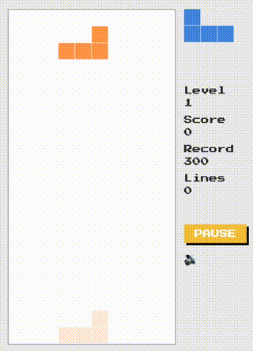

# Tetris на TypeScript

Реализация классической игры Tetris на чистом TypeScript.  
Проект создан с целью отработки работы с Canvas, коллизиями, гейм-циклами и типами.

## 🔧 Стек

- TypeScript
- Canvas API
- HTML5
- Vite

## 🧠 Особенности

- FSM (машина состояний)
- Гибкая архитектура: игровая петля, обработка событий, рендер
- Типизированная модель фигур

## 🚀 Демо

[Открыть игру](https://tetris-ts-tau.vercel.app/)



## ⚙️ Локальный запуск

```bash
git clone https://github.com/const-y/tetris-ts.git
cd tetris-ts
npm install
npm dev
```
